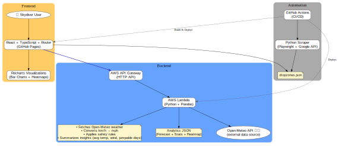
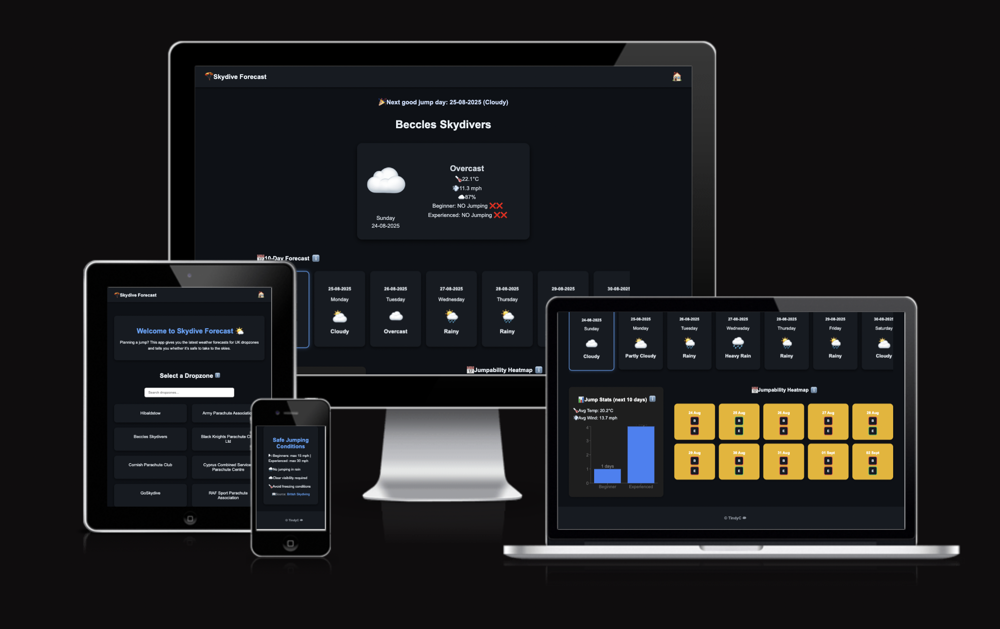

# 🪂 Skydive Forecast  
[🌐 Live Demo](https://tindyc.github.io/skydive-forecast/)  

Planning a jump in the UK? This app helps skydivers check the latest weather at selected dropzones and see if conditions are safe for beginners or experienced jumpers.  

Because sometimes the biggest leap isn’t out of the plane—it’s trusting the weather. 🌤️  

---

## 🛠 Tech Stack  

- **Frontend**  
  - React + TypeScript  
  - React Router – slug-based navigation (`/dropzone/skydive-langar`)  
  - Recharts – interactive bar charts & heatmaps  
  - Responsive CSS + tooltips  

- **Backend**  
  - AWS Lambda + API Gateway – serverless forecast API  
  - Python + Pandas – data analytics & safety rules  
  - Open-Meteo API – free forecast provider  

- **Automation**  
  - Python Scraper (Playwright + Google Geocoding API) – updates `dropzones.json` automatically  
  - GitHub Actions – automates: scraper → commit → Lambda deploy → frontend build & deploy  

---

## ✨ Features  

- **UK Dropzones** – includes *all official [British Skydiving](https://britishskydiving.org/find-drop-zone/)* dropzones (scraped automatically).  

- **🔍 Smart Dropzone Search**  
  - Autocomplete suggestions while typing.  
  - Navigate with **⬆️ / ⬇️ keys** + **Enter** to jump directly.  
  - Mobile-friendly and responsive design.  

- **Beginner vs Experienced Rules** – conditions assessed differently for new vs seasoned skydivers.  

- **Weather Insights** – daily forecasts include:  
  🌡 Temperature · 🌧 Rain chance · 💨 Wind speed (mph) · ☁️ Cloud cover · ✍️ Simple text summary  

- **Safe/No Jump Indicators** – “GOOD ✅” or “NO Jumping ❌” guidance per day.  

- **Mobile-friendly UI** – scrollable forecast cards, responsive layouts.  

- **Educational Tooltips** – explain safe skydiving conditions (sourced from [British Skydiving](https://britishskydiving.org/)).  

---

## 📊 New: Jump Stats & Visual Forecasts  

I’ve added an **analytics layer** to help skydivers understand conditions at a glance — not just raw numbers.  

### 🔹 Smarter Insights  
The **backend now summarizes the raw forecast into meaningful insights**, including:
 
- 🌡 **Average temperature** over the forecast period.  
- 💨 **Average wind speed**.  
- ✅ **Number of safe jump days** for Beginners vs Experienced skydivers.  
- 🎯 **Best Jump Day** – automatically highlighted in a banner at the very top. Click it to instantly view full forecast details in the main card.


#### Example Output  

When you request the forecast for a dropzone, the app also returns an **analytics summary** like this for each selected dropzone:  

```json
"analytics": {
  "avg_temp": 18.6,
  "avg_wind": 12.2,
  "jumpable_days_beginner": 3,
  "jumpable_days_experienced": 6,
  "total_days": 10
}

```
---
**Explained:**  
- 🌡 **avg_temp** → average daily max temperature (**18.6°C**).  
- 💨 **avg_wind** → average wind speed (**12.2 mph**).  
- ✅ **jumpable_days_beginner** → safe days for beginners (**3 days**).  
- ✅ **jumpable_days_experienced** → safe days for experienced skydivers (**6 days**).  
- 📅 **total_days** → number of forecast days (**10**).  

So in this example:  
- Beginners can expect **3 safe days** in the next 10.  
- Experienced skydivers have more flexibility with **6 safe days**.  
- Average conditions are **18.6°C** with winds around **12 mph**.  

---

### 🔹 Easy-to-Read Visuals  

The frontend uses **Recharts** to display:  
- **Bar Chart** → safe days for Beginners vs Experienced.  
- **Heatmap Calendar** → daily jumpability (🟢 good, 🟡 marginal, 🔴 unsafe).  
- **Key Stats Cards** → quick view of average temp 🌡 and wind speed💨.  

---
## 🖱️ Interactive & Responsive Forecast Cards  

One of the most useful features of the app is that you can **click on any forecast card** (either in the row of small daily cards, or in the heatmap) and it will instantly show **more details in the big main card**.  

### 🔹 How it works :
- The app always keeps track of **which day is currently selected**.  
- By default, it starts with the **first forecast day**.  
- When you **click on a mini card**, the app updates that selection.  
- The big card then shows the details for the **selected day**.  

So you can quickly scroll through the week and see full details for any day with just one click.  

### 🔹 Example in the code  

```tsx
// Keep track of which forecast day is selected
const [selectedDay, setSelectedDay] = useState<ForecastDay | null>(null);

// Show the first day by default
setSelectedDay(parsed.forecast[0]);

// Mini cards: when clicked, update the selected day
<div
  key={day.date}
  className={`mini-weather-card ${
    selectedDay?.date === day.date ? "active" : ""
  }`}
  onClick={() => setSelectedDay(day)}  // ✅ updates the selected day
>
  <WeatherCard day={day} isBig={false} />
</div>

// Big card: always shows the currently selected day
{selectedDay && (
  <div className="big-weather-card">
    <WeatherCard day={selectedDay} isBig={true} />
  </div>
)}


````

## 🚀 Phase 2 — Upgrades & Optimizations  

### 🔹 Automated Dropzones  
- Python scraper (`tools/scraper.py`) fetches dropzone names from British Skydiving.  
- Uses Google Geocoding API for lat/lon.  
- Updates `public/dropzones.json` automatically.  

### 🔹 CI/CD with GitHub Actions  
- Workflow (`.github/workflows/update-dropzones.yml`) automates:  
  - Running the scraper  
  - Committing `dropzones.json`  
  - Deploying Lambda  
  - Building & publishing frontend to GitHub Pages  

### 🔹 Optimized Lambda  
- **Before:** fetched forecasts for *all dropzones* → very slow.  
- **Now:** fetches only the **requested dropzone** via `?dz=DropzoneName`.  
- Applies beginner/experienced rules server-side.  
- ✅ Faster, smaller payloads  
- ✅ Always in sync with scraper updates  

---

## 🏗️ Architecture  

<p align="center">
  
</p>

### Flow  
1. **Scraper (Python + Playwright + Google API)**  
   - Scrapes dropzones → geocodes → saves to `dropzones.json`.  
   - GitHub Actions commits updates.  

2. **Frontend (React, GitHub Pages)**  
   - Loads dropzones from JSON.  
   - Renders forecasts + analytics visually.  

3. **API Gateway + Lambda (Python + Pandas)**  
   - Handles requests (`?dz=DropzoneName`).  
   - Fetches forecast from Open-Meteo.  
   - Applies safety rules.  
   - Returns forecast + analytics + heatmap.  

4. **Frontend UI**  
   - Displays daily forecasts, analytics cards, bar charts, and heatmaps.  

---
### 📱 Responsiveness  

The app has been styled in **CSS** to ensure the layout works across **all devices**:  

- On **desktop screens**, the analytics card and heatmap sit **side by side**, filling the page width.  
- On **mobile and tablets**, the cards stack vertically for easy scrolling.  
- Mini forecast cards are **scrollable horizontally** on smaller screens.  
- Font sizes, icons, and padding **adapt fluidly** so the experience feels natural whether you’re on a phone, tablet, or large monitor.  

This means the interactive forecast is not only functional but also **responsive**, filling the page across all screen sizes.  

  

---

## 🚀 Getting Started  

1. **Clone the repo**  
   ```
   git clone https://github.com/yourname/skydive-forecast.git
   cd skydive-forecast
   ```
2. **Install dependencies**
````
npm install
````

3. ***Start the app locally***
```
npm run dev
```

4. ***Deploy ( GitHub Pages)***
In App.tsx, make sure the router is wrapped with:
```
<Router basename="/skydive-forecast">
````
Then build and publish with:
```
npm run build
npm run deploy
```

## Future Ideas
1. Add more dropzones (UK & worldwide 🌍). 

 Added ✅

2. Notifications/alerts when a “GOOD ✅” day is coming up.

 Added ✅

3. Altitude-adjusted forecasts – calculate conditions at jump altitude (not just ground).

4. Data analytics & graphs:

* Use Pandas to process the fetched weather data.

* Show averages, min, max of wind speed, temperature, and cloud cover.

Added ✅

* Highlight how many “GOOD ✅” days are expected in the next 10 days.

* Add trend charts (line graphs of wind speeds, temperatures, rain probability).

5. Visual dashboards:

* Bar charts for “jumpable vs no-jump days” per dropzone.

* Pie charts comparing beginner vs experienced safe days.

Added ✅

* Rolling averages to show seasonal patterns (e.g., best months to jump).

6. User experience features:

* Allow users to favourite dropzones and view combined stats.

* Compare two dropzones side by side (e.g., Hibaldstow vs Langar).

* Export reports (PDF or CSV) with conditions summary.

7. Machine learning ideas:

* Predict the best jump days using past data + forecast trends.

* Show “confidence scores” for forecasts.

## 🙏 Acknowledgements

- [British Skydiving](https://britishskydiving.org/) – official safety guidelines & DZ list.  
- [Open-Meteo](https://open-meteo.com/) – free weather data.  
- [Adobe Firefly](https://www.adobe.com/sensei/generative-ai/firefly.html) – used to generate the skydiver cartoon character for the preloader animation.  
- Tools & packages that power this project.  
