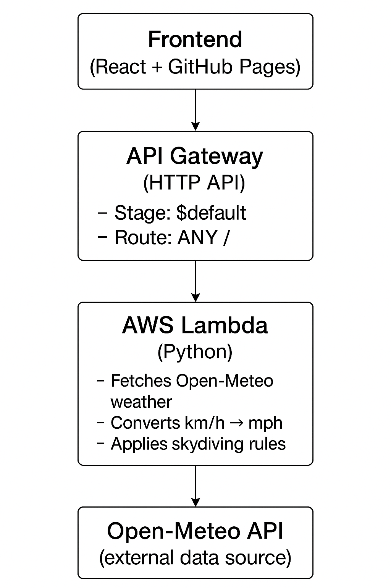

# 🪂 Skydive Forecast  
[Production Site](https://tindyc.github.io/skydive-forecast/) 


Planning a jump in the UK? This app helps skydivers check the latest weather at selected dropzones and see if conditions are safe for beginners or experienced jumpers.  

Because sometimes the biggest leap isn’t out of the plane—it’s trusting the weather. 🌤️  

---

## ✨ Features  

- **UK Dropzones** – currently includes Hibaldstow, Langar, and Dunkeswell (with room to grow).  
- **Beginner vs Experienced** – conditions are assessed differently depending on skill level.  
- **Weather Insights** – clear daily forecasts: temperature, rain, wind (in mph), cloud cover, and a simple description.  
- **Safe/No Jump Indicators** – “GOOD ✅” or “NO Jumping ❌” guidance for each day.  
- **Mobile-friendly UI** – scrollable forecast cards and responsive design for checking on the go.  
- **Educational Tooltips** – explanations of safe jumping conditions, sourced from British Skydiving.  

---
## 🛠 Tech Stack  

I’ve kept things lightweight but practical:  

- **React + TypeScript** – a solid foundation for a clean, component-based UI.  
  - Example: `WeatherCard.tsx` renders forecast cards with icons, conditions, and safety checks.  

- **React Router** – enables dropzone pages and navigation (`App.tsx` has a simple navbar and routes).  
  - Configured with `basename="/skydive-forecast"` so it works when deployed on **GitHub Pages**, where apps are served from a subpath instead of the domain root.  

- **CSS** – customised styles in `App.css` and `WeatherCard.css` for a modern, dark, skydiving-friendly look.  

- **AWS Lambda + API Gateway (Serverless Backend)** – the core of the app.  
  - The Lambda function fetches **10 days of forecast data** from [Open-Meteo](https://open-meteo.com/) for each dropzone.  
  - Converts **wind speed** from km/h → mph so it makes sense to UK jumpers.  
  - Applies **skydiving-specific safety rules** to decide if each day is a “GOOD ✅” or “NO Jumping ❌” day for **beginners vs experienced** skydivers.  
  - Returns the processed forecast via a simple JSON API, which the React frontend consumes.  
  - **Why Lambda instead of EC2?**  
    - EC2 = you rent a server that runs 24/7, even if no one is using it. You pay monthly, whether idle or busy.  
    - Lambda = code runs **on demand** only when a request comes in. If no one uses the app today, it costs **nothing**.  
    - For a project like this (sporadic traffic, lightweight workloads), Lambda is dramatically cheaper and easier — and almost always stays within AWS’s free tier.  

- **Open-Meteo API** – Free and reliable weather data provider. 

---

## 🤔 Why These Choices?  

- **React + TypeScript**: I wanted strong typing (to avoid silly bugs) and reusable components. It also makes the UI easier to maintain and extend.  
- **React Router**: Makes the app feel like a proper multi-page site without leaving the browser. Using `basename` was essential for GitHub Pages deployment (otherwise routing would break on refresh).  
- **Lambda**: I’m not running a full backend, just need to fetch and filter weather. Serverless is simple, and scales without me worrying.  
- **Custom CSS**: Could’ve used a UI library, but I wanted full control to refresh my CSS skills. The design is minimal, following a less is more style.  

---
## 🏗️ Architecture 🌐 API Gateway Setup  

The project runs as a lightweight serverless full-stack app:



### How It Works:

#### React Frontend (GitHub Pages)

Users select a dropzone → app makes a fetch request.

#### API Gateway (HTTP API)

Stage: $default → API is reachable at:
```
https://<api-id>.execute-api.<region>.amazonaws.com/
```
(no /default path required).

Route: ANY / → all requests at / are sent to Lambda.

### AWS Lambda (Python)

Fetches Open-Meteo API for each dropzone.

Converts wind speeds (km/h → mph).

Applies beginner vs experienced jump rules.

Returns a structured JSON response.

#### Frontend consumes JSON → Displays forecasts + “GOOD ✅ / NO ❌” jump indicators.
---

## 🚀 Getting Started  

1. **Clone the repo**  
   ```
   git clone https://github.com/yourname/skydive-forecast.git
   cd skydive-forecast
   ```
2. **Install dependencies**
````
npm install
````

3. ***Start the app locally***
```
npm run dev
```

4. ***Deploy ( GitHub Pages)***
In App.tsx, make sure the router is wrapped with:
```
<Router basename="/skydive-forecast">
````
Then build and publish with:
```
npm run build
npm run deploy
```

## Future Ideas
1. Add more dropzones (UK & worldwide 🌍).

2. Notifications/alerts when a “GOOD ✅” day is coming up.

3. Altitude-adjusted forecasts – calculate conditions at jump altitude (not just ground).

4. Data analytics & graphs:

* Use Pandas to process the fetched weather data.

* Show averages, min, max of wind speed, temperature, and cloud cover.

* Highlight how many “GOOD ✅” days are expected in the next 10 days.

* Add trend charts (line graphs of wind speeds, temperatures, rain probability).

5. Visual dashboards:

* Bar charts for “jumpable vs no-jump days” per dropzone.

* Pie charts comparing beginner vs experienced safe days.

* Rolling averages to show seasonal patterns (e.g., best months to jump).

6. User experience features:

* Allow users to favourite dropzones and view combined stats.

* Compare two dropzones side by side (e.g., Hibaldstow vs Langar).

* Export reports (PDF or CSV) with conditions summary.

7. Machine learning ideas:

* Predict the best jump days using past data + forecast trends.

* Show “confidence scores” for forecasts.

## 🙏 Acknowledgements

British Skydiving for the official safety guidelines.

Open-Meteo for free forecast data.

And everyone who’s built the tools and packages I’m borrowing to get this project off the ground.

